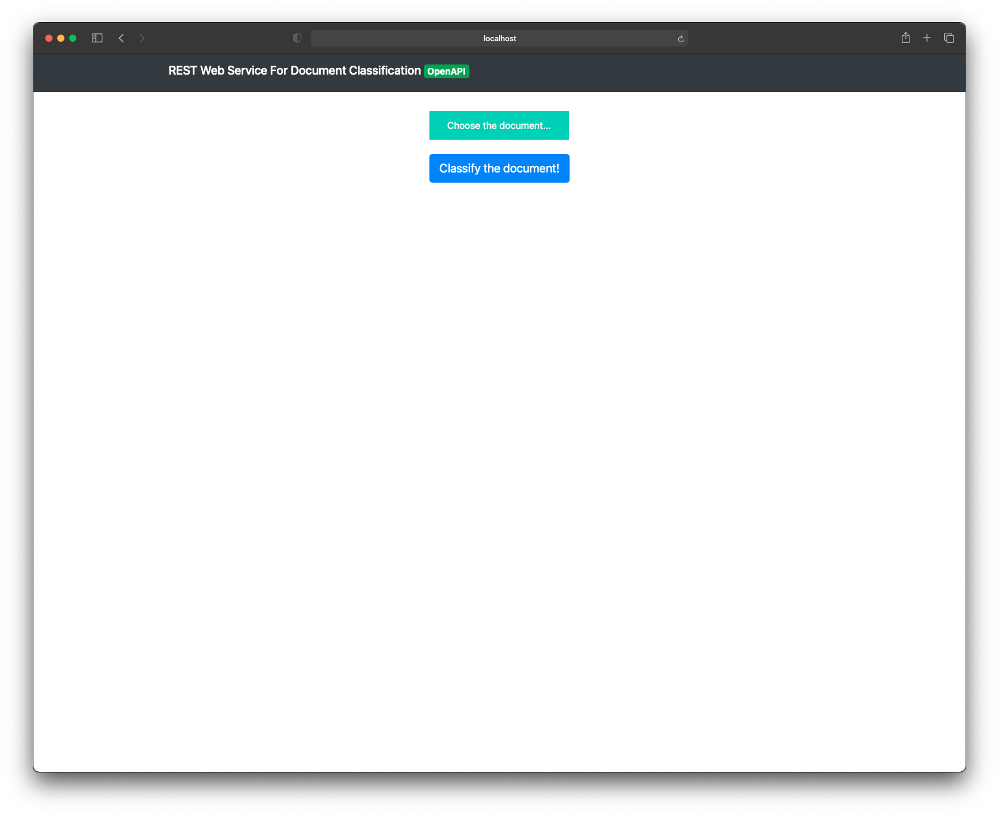

# Doc Classifier

Create a docker image:

      $ make build

Run container (or skip the first command and simply):

      $ make run

Open in the browser:

      $ make open

The app looks like the following.

Once the document was chosen press the 'Classify the document!' button.

The result will be similar to this.

Also, there are REST API to be easily integrated with. OpenAPI page looks like the following.

Example of the request on the `/doc_type/predict` endpoint looks like:

